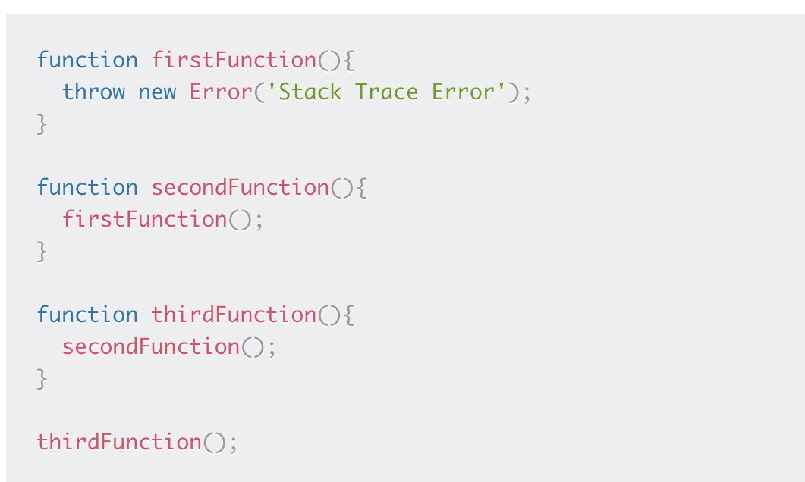

# Day 9 Notes

## In Memory Storage

### Understanding the JavaScript Call Stack

• What is a ‘call’?

  > Function invocation

• How many ‘calls’ can happen at once?

  > One at a time

• What does LIFO mean?

  > Last in, first out.

• Draw an example of a call stack and the functions that would need to be invoked to generate that call stack.

  > 

• What causes a Stack Overflow?

  > *"A stack overflow occurs when there is a recursive function (a function that calls itself) without an exit point. The browser (hosting environment) has a maximum stack call that it can accomodate before throwing a stack error."*

### JavaScript Error Messages

• What is a ‘reference error’?

  > When you try and use a variable that isn't declared

• What is a ‘syntax error’?

  > When you have something that can't be parsed in terms of syntax

• What is a ‘range error’?

  > Trying to manipulate an obj with some kind of length and give it an invalid length

• What is a ‘type error’?

  > When the types (number, string etc) you are trying to use/ access are incompatible

• What is a breakpoint?

  > A way to make your program stop at that point if the condition is met

• What does the word ‘debugger’ do in your code?

  > Runs code step by step in a debugging tool (like VS code) to find where you made a mistake

### Things I want to know more about

> I would like to memorize the JS errors the best I can.

### Sources

https://www.freecodecamp.org/news/understanding-the-javascript-call-stack-861e41ae61d4

Click to return [Home!](../README.md)
