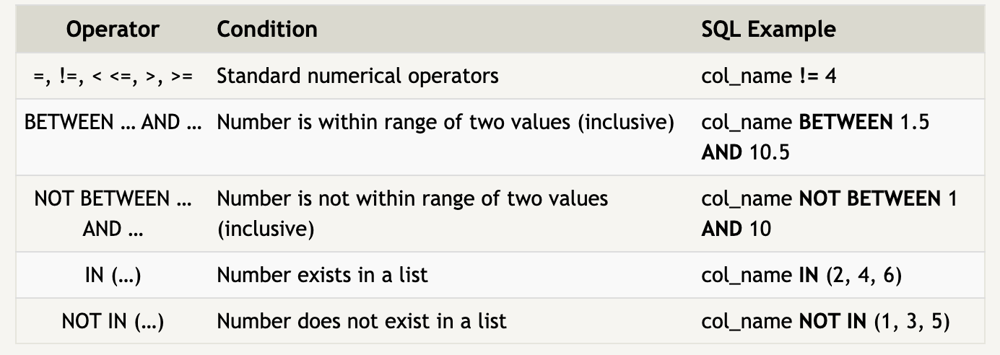

# Pre Work

## 401 Pre-Work

### SQL and Relational Databases

• What is SQL?
  > SQL aka Structured Query Language is a language designed to allow technical and non-technical users query, manipulate and transform data from a relational database.

• What is a Relational Database?
  > A relational database represents a collection of related (two dimesional) tables, similar to an Excel spreadsheet, with a fixed number of named columns and any number of rows of data.

### SQL Lesson 1 Notes

• To retreive data from an SQL database, we need to write SELECT statements also known as queries. A query in itself is just a statement which declares what data we are looking for.

• To retrieve ALL of the columns of data from a table we use the asterisk (*).

### SQL Lesson 2 Notes

• To filter certain results from being returned, use a WHERE clause in the query.

• More complex clauses can be created by joining AND or OR logical keywords such as:

### SQL Lesson 3 Notes

• When writing WHERE clauses with columns containing text data, all strings must be quoted so that the query parser can distinguish words in the string from SQL words.

### SQL Lesson 4 Notes

• Use DISTINCT to discard rows that have a duplicate column value.

• You can organize your data table in ascending or descending order by using the ORDER BY clause. You can also use LIMIT to reduce the number of rows to return and OFFSET will specify where to begin counting the rows from.

### SQL Lesson 6 Notes

• Entity data in the real world is often broken down into pieces and stored across multiple orthogonal tables using a process known as normalization

• Using the JOIN clause in a query, we can combine row data across two separate tables using this unique key

### SQL Lesson 13 Notes

• To add data into our table use INSERT

### SQL Lesson 14 Notes

• To update existing data use UPDATE

### SQL Lesson 15 Notes

• To delete data from the table use DELETE

### SQL Lesson 16 Notes

• To make a new table use CREATE TABLE

### SQL Lesson 17 Notes

• Use ALTER TABLE to add, remove, or modify columns and table constraints.

### SQL Lesson 18 Notes

• To remove an entire table use DROP TABLE, there may be an error if the specified table does not exist so to avoid this use the IF EXISTS.

### SCREEN SHOTS OF LESSONS COMPLETED

#### Sources

https://sqlbolt.com/

Click to return [Home!](../README.md)
