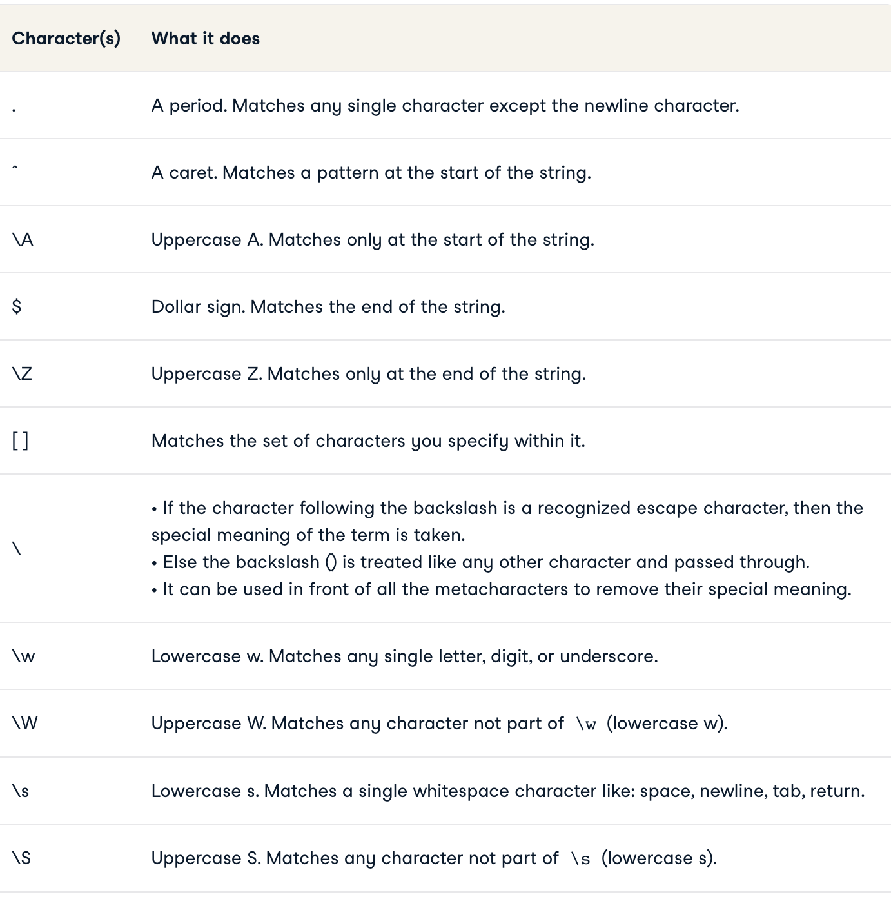
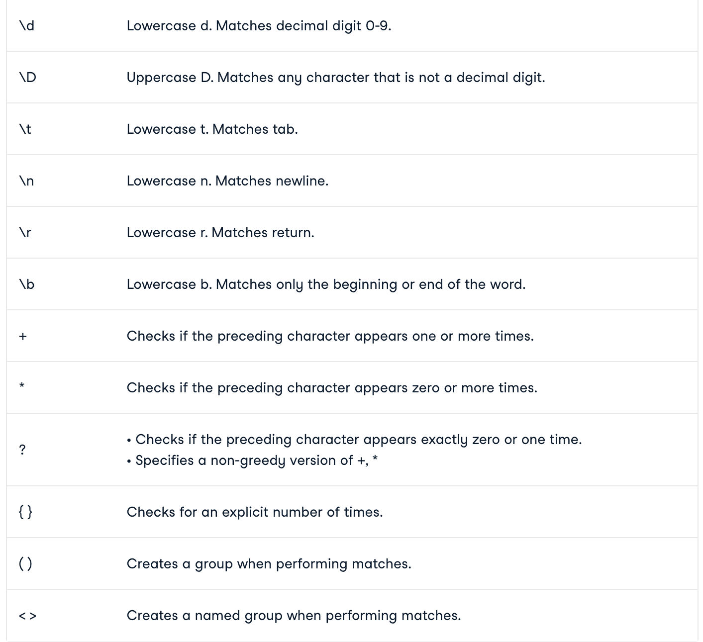

# Day 16 Notes

## Automation

### Python Regular Expressions Tool

> Regular exression is Regex

• It is a sequence of characters used to check whether a pattern exists in a given string or not.

• To import regex use import re

> Cheatsheet

• match() returns a match object if the text matches the pattern.

• search() scans through the given string/sequence, looking for the first location where the regex produces a match

• group() returns the string matched by the re

• findall() finds all possible matches and returns them as a list of strings

• finditer() finds all possible matches but returns regex match objects as an iterator

• sub() returns the string obtained by replacing or substituting the leftmost non-overlapping occurrences of pattern in string by the replacement.

• subn() similar to sub() but it returns a tuple containing a new string value and the number of replacements that were performed

• split() splits the strings wherever the pattern matches and returns a list

• start() returns the starting index of the match.

• end() returns the index where the match ends.

• span() returns a tuple containing the (start, end) positions of the match.

• IGNORECASE(I) allows case-insensitive matches.

• DOTALL(S) allows . to match any character, including newline.

• MULTILINE(M) allows start of string (^) and end of string ($) anchor to match newlines as well.

• VERBOSE(X) allows you to write whitespace and comments within a regular expression to make it more readable.

### Shutil

> The shutil module includes high-level file operations such as copying and archiving.

• copyfile() copies the contents of the source to the destination and raises IOError if it does not have permission to write to the destination file.

• copy() interprets the output name like the Unix command line tool cp

• copy2() works like copy(), but includes the access and modification times in the metadata copied to the new file.

• copymode() copies the permissions from one file to another

• copystat() copies metadata about the file

• copystat() copies the permissions and dates associated with the file

• copytree() copies a directory from one place to another

• ignore_patterns() creates an ignore function to skip copying Python source files

• verbose_copy() prints the names of files as they are copied then uses copy2()

• rmtree() removes a directory and its contents

• move() moves a file or directory from one place to another

• which() scans a search path looking for a named file

• get_archive_formats() returns a sequence of names and descriptions for formats supported on the current system

• make_archive() creates a new archive file

• unpack_archive() extracts the archive passing the file name/directory where it should be extracted

• disk_usage() returns a tuple with the total space, the amount currently being used, and the amount remaining free

#### Things I want to know more about

> How to implement these

#### Sources

[Python Regular Expressions Tutorial](https://www.datacamp.com/tutorial/python-regular-expression-tutorial)

[Shutil](https://pymotw.com/3/shutil/)

Click to return [Home!](../README.md)
