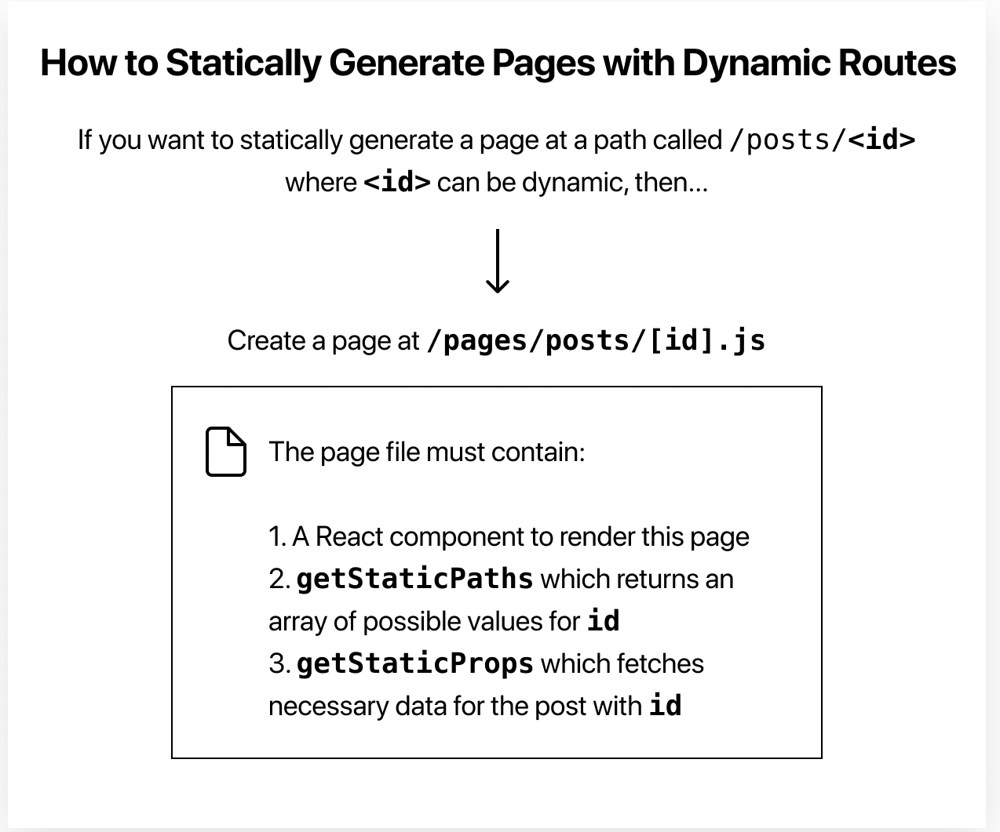

# Day 33 Notes

## React 4

### Dynamic Routes

### Deployment

• The easiest way to deploy Next.js to production is to use the Vercel platform developed by the creators of Next.js.

• Import your nextjs-blog repository on Vercel.

• You can use default values for the following settings — no need to change anything. Vercel automatically detects that you have a Next.js app and chooses optimal build settings for you.

> Project Name
--------
> Root Directory
--------
> Build Command
--------
> Output Directory
--------
> Development Command

• When you deploy, your Next.js app will start building. It should finish in under a minute.

• When it’s done, you’ll get deployment URLs. Click on one of the URLs and you should see the Next.js starter page live.

• Develop: We’ve written code in Next.js and used the Next.js development server running to take advantage of its hot reloading feature.

• Preview: We’ve pushed changes to a branch on GitHub, and Vercel created a preview deployment that’s available via a URL. We can share this preview URL with others for feedback. In addition to doing code reviews, you can do deployment previews.

• Ship: We’ve merged the pull request to main to ship to production.

• Next.js can be deployed to any hosting provider that supports Node.js.

#### Things I want to know more about

> How to deploy a site!

#### Sources

[Dynamic Routes](https://nextjs.org/learn/basics/dynamic-routes/implement-getstaticprops)

[Deployment](https://nextjs.org/learn/basics/deploying-nextjs-app/finally)

Click to return [Home!](../README.md)
