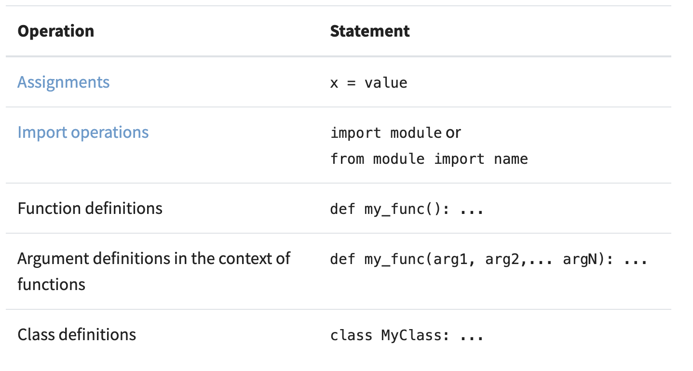

# Read: Class 07

## Global and nonlocal

### Python Scope

• Scope rules how variables and names are looked up in your code.

• Global Scope: The names that you define in this scope are available to all your code.

• Local Scope: The names that you define in this scope are only available or visible to the code within the scope.

> *When you can access the value of a given name from someplace in your code, you’ll say that the name is* **in scope**. *If you can’t access the name, then you’ll say that the name is* **out of scope**.

• Variables in Python come to exist when you first assign them value.

• Functions and classes are available after you define them (you do this by using def or class).

• Modules exist after you import them.

> *If you assign a value to a name inside a function, then that name will have a* **local Python scope**. *In contrast, if you assign a value to a name outside of all functions—say, at the top level of a module—then that name will have a* **global Python scope**.

• Built in functions
  > globals() : returns a reference to the current global scope or namespace dictionary
  > locals() : updates and returns a dictionary that holds a copy of the current state of the local Python scope or namespace
  > vars() : returns the .__dict__ attribute of a module, class, instance, or any other object which has a dictionary attribute
  > dir() : you can use it without arguments to get the list of names in the current Python scope

### Things I want to know more about

> All of it. I feel like I have zero grasp on this or whats going on.

#### Sources

https://realpython.com/python-scope-legb-rule/

Click to return [Home!](../README.md)
